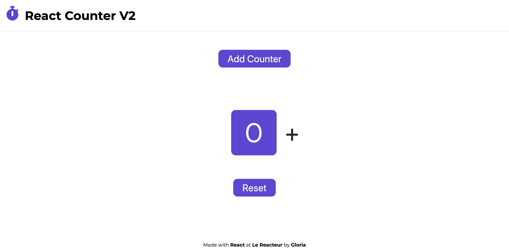
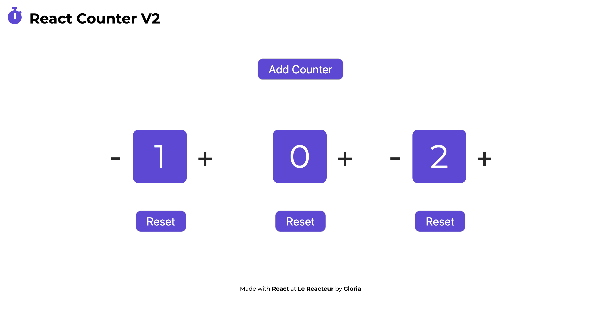

# Counters

## Description

With this project you can increment and decrement counters. You can add counters too. The responsive is included.

## Installation

First, clone the project: https://github.com/gloluz/counter.git

## Read

To read this project:

`yarn start`

Or with this link: [https://elastic-shaw-822966.netlify.com/]

## Contributing

To contributing please refer to the [CONTRIBUTING.MD](CONTRIBUTING.MD)

## License

[LICENSE MIT](LICENSE)
